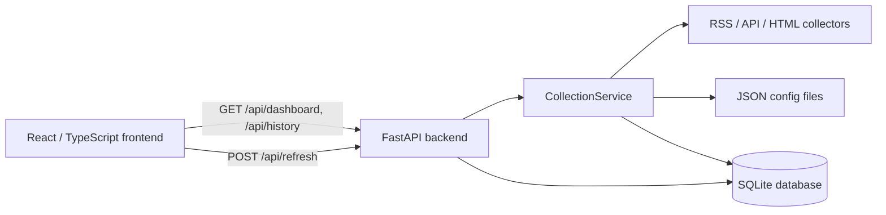
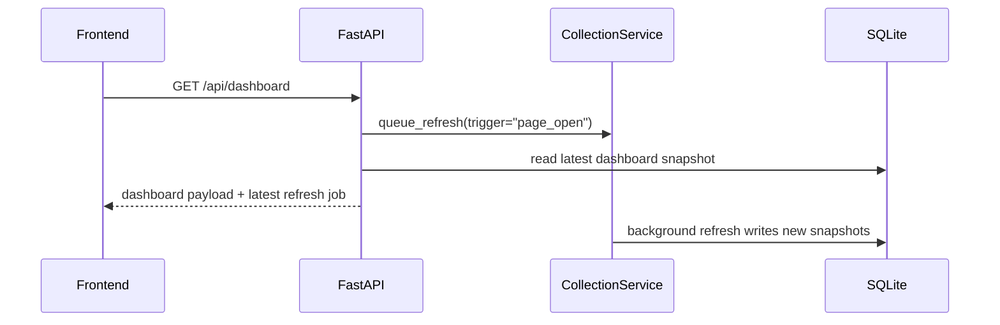
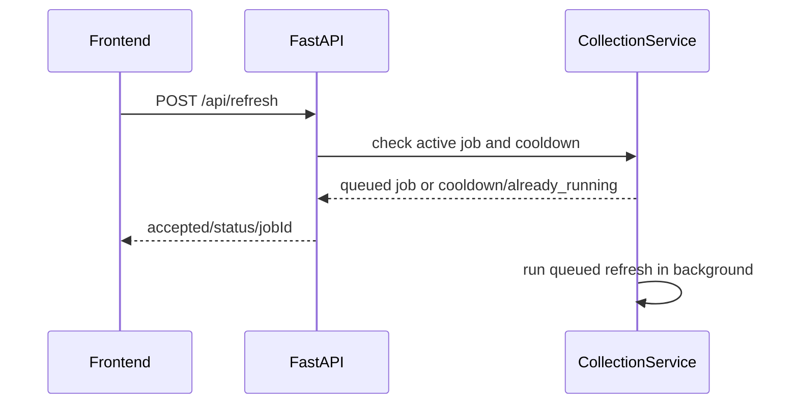

# HotRadar Architecture

HotRadar is a local-first full-stack news and trend aggregation app. It is designed as a personal MVP, not a production-scale distributed system.

## Component Diagram

## Responsibilities

- Frontend: renders dashboard, history search, source debug status, refresh controls, source navigation, keyword highlights, and signal badges.
- FastAPI backend: exposes API contracts, schedules background refresh tasks, applies optional admin-token protection, and returns SQLite-backed responses.
- CollectionService: owns refresh locking, manual cooldown, refresh job state, collector orchestration, keyword loading, signal scoring, and structured logging.
- Collectors: fetch and normalize source-specific RSS/API/HTML payloads into `HotItem` objects. A collector failure is recorded and does not stop other sources.
- SQLite: persists unique hot items, every fetch snapshot, fetch runs, fetch errors, source health, and schema migration versions.
- Config files: `config/watch-keywords.json` controls keyword matching; `config/signal-rules.json` controls official AI / Big Tech signal scoring.

## Dashboard Load Flow

Dashboard loads return the latest persisted data immediately. A background refresh may run after the response, so the UI remains usable even if collectors are slow or failing.

## Manual Refresh Flow

Manual refresh uses both a cooldown and a non-blocking refresh lock. Repeated clicks do not start duplicate collection work; clients can inspect the latest job through `GET /api/refresh/status`.

## Scheduled Refresh Flow

When `HOTRADAR_ENABLE_SCHEDULER=1`, FastAPI starts an async scheduler during application lifespan. The scheduler sleeps for `HOTRADAR_SCHEDULED_REFRESH_MINUTES`, queues a refresh job, and runs it in a worker thread. If another refresh is already queued or running, the scheduled job is skipped.

## Collector Failure Behavior

- Each source creates a `fetch_runs` row before fetching.
- Successful collectors save normalized items and snapshots, then update `source_status`.
- Expected collector failures are written to `fetch_errors` and `source_status` with error type, HTTP status, and a bounded response snippet.
- Unexpected exceptions are logged with structured exception details and recorded as failed source runs.
- The dashboard keeps showing the last successful data for a degraded source instead of exposing stack traces.

## Database Design

HotRadar separates unique items from observations:

- `hot_items` stores one row per source-specific dedupe key.
- `hot_item_snapshots` stores each observation of an item, including rank, heat, summary, fetched time, matched keywords, and signal metadata.
- `fetch_runs` and `fetch_errors` provide operational history.
- `source_status` stores the latest source health view for dashboard/debug APIs.
- `schema_migrations` tracks applied SQLite migration files from `migrations/`.

Snapshots are separate because ranks, heat, summaries, and keyword matches can change over time even when the underlying source URL is the same.

## API Endpoints

- `GET /`: health check.
- `GET /api/dashboard`: dashboard sections, source panels, latest items, and latest refresh job.
- `POST /api/refresh`: queues manual refresh when not cooling down or already running.
- `GET /api/refresh/status`: latest refresh job status.
- `GET /api/history`: paginated history search with `q`, `source`, `section`, `start`, `end`, `limit`, and `offset`.
- `GET /api/sources/status`: source health rows.
- `GET /api/debug/sources`: debug-oriented source health rows.

Operational endpoints `POST /api/refresh`, `GET /api/refresh/status`, `GET /api/sources/status`, and `GET /api/debug/sources` can be protected with `HOTRADAR_REQUIRE_ADMIN_TOKEN=1` and `HOTRADAR_ADMIN_TOKEN`.

## Deployment Shape

Local development can run FastAPI and Vite directly. Docker Compose runs two services:

- `backend`: FastAPI + SQLite + migrations.
- `frontend`: Nginx serving the React build and proxying `/api` to `backend:8000`.

SQLite is persisted through the `hotradar-data` Docker volume.

## Known Limitations

- This is a local-first personal MVP, not a multi-user hosted service.
- SQLite is appropriate for local persistence but not a high-write distributed workload.
- Some collectors depend on public pages that may change markup or enforce anti-bot rules.
- Admin-token protection is intentionally simple; it is not a full authentication system.
- Offset pagination is simple and debuggable, but cursor pagination would be better for large, frequently changing datasets.
- CI is configured, but it only runs after the project is pushed to GitHub.

## Future Production Considerations

- Add real authentication before exposing the app publicly.
- Move secrets to a managed secret store for any cloud deployment.
- Replace SQLite with a managed database if multi-user write volume or concurrent writes become important.
- Add request metrics, alerting, and log aggregation.
- Add collector contract tests with saved upstream payload fixtures.
- Add measured performance benchmarks before claiming latency improvements.
- Use a verified AWS deployment path such as EC2 with Docker Compose or ECS/Fargate before mentioning AWS deployment on a resume.
